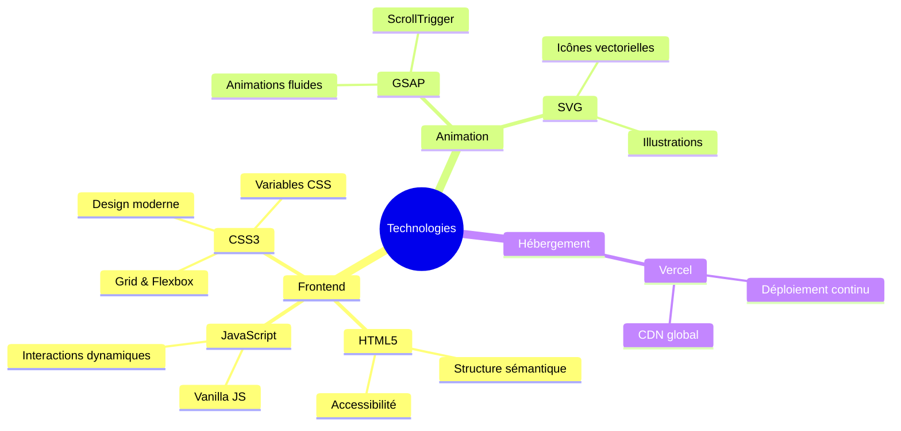
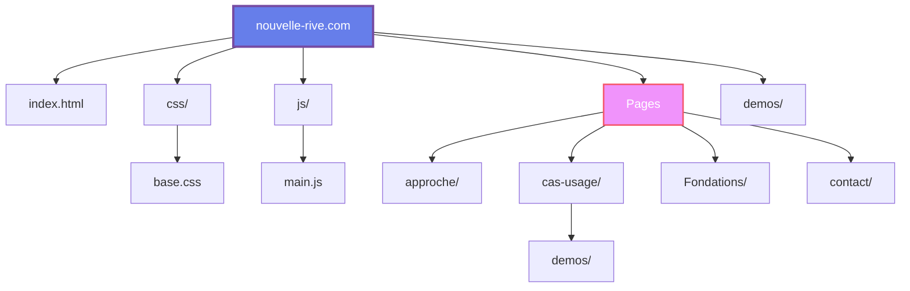
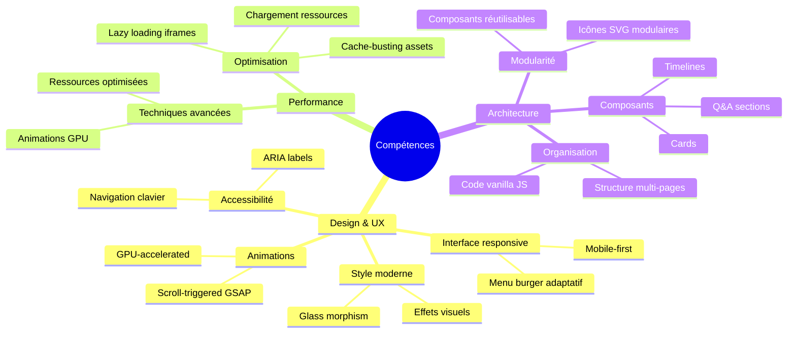
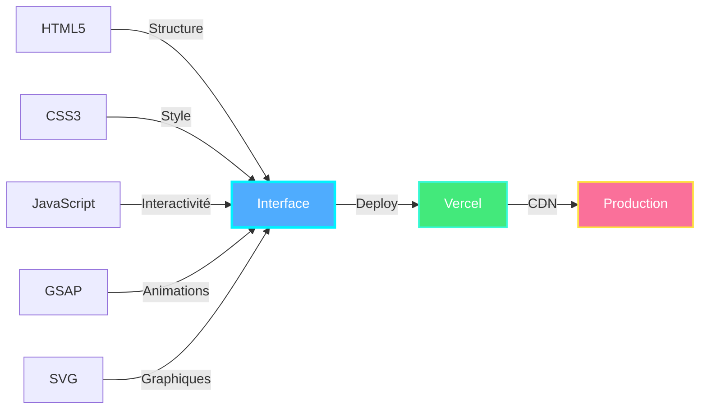

# nouvelle-rive.com

Site vitrine de démonstration technique

**Démo en ligne** : https://nouvelle-rive.vercel.app

---

## 📋 À propos

Ce projet est un site vitrine créé pour démontrer mes compétences en développement web front-end. Il présente une offre de services d'automatisation et d'IA, avec plusieurs pages thématiques (cas d'usage, méthodologie, valeurs).

L'objectif est de montrer ma capacité à créer une interface professionnelle, fluide et accessible, tout en communiquant sur des sujets techniques complexes de manière claire.

---

## 🛠️ Technologies utilisées

---

## 📁 Structure du projet

---

## 💡 Compétences démontrées

---

## 🚀 Stack technique détaillée

---

## 📊 Statut

**Statut** : ✅ Démo en ligne
**Dernière mise à jour** : Novembre 2025
